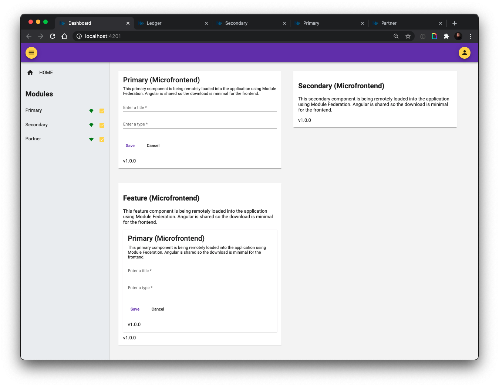

# Federated Modules Example

This is an example demonstrating how we can use federated modules to solve enterprise-level problems.

## Prerequisites

- [Git](https://git-scm.com/book/en/v2/Getting-Started-Installing-Git)
- Node.js and NPM – we recommend using [NVM (Linux/Mac)](https://github.com/creationix/nvm) or [NVM-Windows (Windows)](https://github.com/coreybutler/nvm-windows)
- Install Angular CLI via `npm i -g @angular/cli`

## Getting Started

Because this is a demonstration of how to consume N number of hosted applications into a single application, we will be spinning a couple of stand alone applications at once. 

```bash
git clone https://github.com/briebug/ng-module-republic.git
cd ng-module-republic
yarn
yarn serve:all
```

And run each of these commands in their own tab.

```bash
yarn serve:primary
yarn serve:secondary
yarn serve:partner
```

The `serve:all` command is a convenience methods that runs the `serve:api`, `serve:ledger` and `serve:dashboard` commands concurrently. You can run each command separately if you need to.

```json
"serve:api": "nx run api:serve",
"serve:ledger": "nx run ledger:serve --port=4200 --open",
"serve:dashboard": "nx run dashboard:serve --port=4201 --open",
"serve:primary": "nx run primary:serve --port=4202 --open",
"serve:secondary": "nx run secondary:serve --port=4203 --open",
"serve:partner": "nx run partner:serve --port=4204 --open",
"serve:remotes": "concurrently \"npm run serve:primary\" \"npm run serve:secondary\" \"npm run serve:partner\"",
"serve:all": "concurrently \"npm run serve:api\" \"npm run serve:ledger\" \"npm run serve:dashboard\"",
```

The `ledger` application will open to [http://localhost:4200](http://localhost:4200) in your browser.

The `dashboard` application will open to [http://localhost:4201](http://localhost:4201) in your browser.

The `primary` application will open to [http://localhost:4202](http://localhost:4202) in your browser.

The `secondary` application will open to [http://localhost:4203](http://localhost:4203) in your browser.

The `partner` application will open to [http://localhost:4204](http://localhost:4204) in your browser.

> Note: the above terminal commands are for Mac. Remember to substitute the appropriate commands for your OS.
